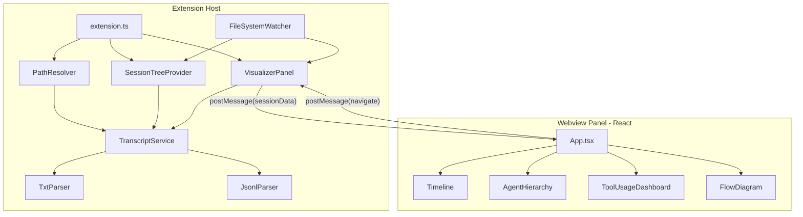

# Agent Visualizer -- Cursor Extension

Visualize your Cursor AI agent's work: conversation timelines, tool usage analytics, agent hierarchy trees, and reasoning flow diagrams -- all inside a VS Code/Cursor extension.

---

## Data Source

Cursor stores agent transcripts at `~/.cursor/projects/<project-slug>/agent-transcripts/`. Two formats exist:

- **`.txt` format** (richer): Plain text with `user:`, `assistant:`, `[Tool call]` (name + params), `[Tool result]` markers. Contains full tool call details including tool names, parameters, and results.
- **`.jsonl` format** (newer): One JSON object per line with `{role, message: {content: [{type, text}]}}`. Parent transcript lives at `{uuid}/{uuid}.jsonl`, subagent transcripts at `{uuid}/subagents/{subagent-uuid}.jsonl`.

The project slug is derived from the workspace path by replacing `/` with `-` and stripping the leading `-`. For example, `/Users/bs1101/Personal/1.projects/foo` becomes `Users-bs1101-Personal-1-projects-foo`.

### Transcript Formats

**`.txt` format example:**

```
user:
<user_query>
Fix the current location button not working.
</user_query>

assistant:
Checking the location service and how it's wired:
[Tool call] Grep
  pattern: currentLocation|use my
  path: /project/lib
[Tool call] Read
  path: /project/lib/location_service.dart

[Tool result] Grep

[Tool result] Read

assistant:
Implementing the fix by adding permission handling:
[Tool call] StrReplace
  path: /project/lib/add_edit_place_page.dart
  old_string: ...
  new_string: ...
```

**`.jsonl` format example:**

```json
{"role":"user","message":{"content":[{"type":"text","text":"<user_query>\nImplement localization.\n</user_query>"}]}}
{"role":"assistant","message":{"content":[{"type":"text","text":"Exploring the project structure..."}]}}
```

---

## Architecture



---

## Unified Data Model

```typescript
interface Session {
  id: string;
  format: "txt" | "jsonl";
  filePath: string;
  firstUserMessage: string;
  messages: Message[];
  subagents: Session[];
}

interface Message {
  role: "user" | "assistant";
  text: string;
  toolCalls: ToolCall[];
}

interface ToolCall {
  name: string;
  parameters: Record<string, string>;
  hasResult: boolean;
}
```

---

## Project Structure

```
agent-visualizer/
  package.json              # Extension manifest (activationEvents, contributes, scripts)
  tsconfig.json
  esbuild.js                # Build script for extension host
  .vscodeignore
  src/
    extension.ts            # activate(): register tree view, commands, panel
    parsers/
      types.ts              # Session, Message, ToolCall interfaces
      txtParser.ts          # Parse .txt transcript format
      jsonlParser.ts        # Parse .jsonl transcript format
    services/
      transcriptService.ts  # Discover + parse all transcripts, cache results
      pathResolver.ts       # Derive transcript folder from workspace path
    providers/
      sessionTreeProvider.ts # TreeDataProvider for sidebar
    panels/
      visualizerPanel.ts    # Manage webview lifecycle, message passing
  webview-ui/
    package.json            # React, D3, Vite
    tsconfig.json
    vite.config.ts
    index.html
    src/
      index.tsx
      App.tsx               # Tab navigation between views
      types.ts              # Shared types (mirrored from extension)
      components/
        Timeline.tsx         # Vertical timeline of conversation + tool calls
        AgentHierarchy.tsx   # D3 tree of parent -> subagent relationships
        ToolUsage.tsx        # Bar/pie charts of tool usage frequency
        FlowDiagram.tsx      # Directed graph of agent reasoning path
        SessionHeader.tsx    # Session metadata display
      hooks/
        useVsCodeApi.ts      # acquireVsCodeApi() + message handling
  resources/
    icon.svg
```

---

## Key Implementation Details

### 1. Transcript Discovery and Parsing

**Path resolution** (`pathResolver.ts`):

- Get workspace path from `vscode.workspace.workspaceFolders[0].uri.fsPath`
- Convert to slug: replace all `/` with `-`, strip leading `-`
- Construct: `~/.cursor/projects/<slug>/agent-transcripts/`

**TxtParser** -- parse the `.txt` format:

- Split by `user:` and `assistant:` markers to identify conversation turns
- Within assistant turns, extract `[Tool call]` blocks (tool name on same line, indented key-value params on subsequent lines)
- Match `[Tool result]` markers to preceding tool calls
- Extract `<user_query>` content from user turns for display titles

**JsonlParser** -- parse the `.jsonl` format:

- Read line-by-line, `JSON.parse` each line
- Build message array from `role` + `message.content[0].text`
- Scan the parent UUID directory for a `subagents/` subfolder
- Recursively parse each subagent `.jsonl` file

### 2. Sidebar Tree View

Register a `TreeDataProvider` contributing to an `activitybar` view container with a custom icon. Tree structure:

```
Agent Sessions
  [icon] "Fix current location button" (02a2c8ff...)
    12 messages, 8 tool calls
    Subagents: none
  [icon] "Implement localization" (50fc022f...)
    43 messages, 25 tool calls
    Subagents (1):
      [icon] Subagent: explore project structure
```

Clicking a session opens the webview panel with that session's visualization.

### 3. Webview Panel (React + D3)

The webview panel is a React application with four tabbed views:

**Timeline View** (default tab):

- Vertical timeline with alternating left/right bubbles for user and assistant
- User messages displayed as blue cards with the query text
- Assistant messages as gray cards with the response text
- Tool calls displayed as collapsible chips between assistant messages (icon + tool name + params summary)
- Color-coded by tool type: Read=green, Write=orange, Shell=purple, Grep=blue, Search=teal

**Agent Hierarchy View**:

- D3 tree layout showing parent session as root node
- Child nodes for each subagent, labeled with the subagent's first user message (task description)
- Click a node to navigate to that session's timeline
- Node size scaled by message count

**Tool Usage Dashboard**:

- Horizontal bar chart: tool frequency (how many times each tool was called)
- Donut chart: tool type distribution
- File list: most frequently accessed files (extracted from Read/Write/Grep path parameters)
- Summary stats cards: total messages, total tool calls, unique files touched

**Flow Diagram**:

- Directed graph showing the agent's reasoning flow
- Nodes: user query -> assistant reasoning -> tool calls (grouped) -> result -> next reasoning step
- Edges show the sequence; parallel tool calls shown as branching paths
- Built with D3 force-directed layout or dagre for automatic layout

### 4. Real-Time Updates

- Use `vscode.workspace.createFileSystemWatcher` on the transcript folder
- On new file or file change, refresh the tree view
- If the changed session is currently displayed in the webview, push updated data to the panel

### 5. Extension Manifest (`package.json` contributes)

- `viewsContainers.activitybar`: Custom "Agent Visualizer" icon in the sidebar
- `views`: "agentSessions" tree view in the custom container
- `commands`: `agent-visualizer.openSession`, `agent-visualizer.refresh`, `agent-visualizer.copySessionId`, `agent-visualizer.filterSessions`, `agent-visualizer.clearFilter`
- `menus`: Tree view title (Filter, Refresh, Clear Filter), context menu on tree items to open or copy session ID

---

## Phased Delivery

### Phase 1 -- MVP

Scaffold the extension, implement parsers for both formats, build the sidebar tree view, and create the webview with the Timeline view. This gives a working extension that lets you browse past sessions and see the full conversation flow with tool calls.

**Deliverables:**
- Extension scaffold (package.json, tsconfig, esbuild)
- TxtParser and JsonlParser
- TranscriptService with path resolution and caching
- SessionTreeProvider (sidebar)
- Webview panel with Timeline component

### Phase 2 -- Analytics (Complete)

Add the Agent Hierarchy and Tool Usage Dashboard views to the webview. Add session statistics in tree view tooltips and descriptions.

**Deliverables:**
- AgentHierarchy component (D3 tree)
- ToolUsage dashboard (charts + file list)
- Enhanced tree view with stats

### Phase 3 -- Polish (Complete)

Add the Flow Diagram view, real-time file watching, search/filter in sidebar, and polish the UI with VS Code theme integration and robust error handling.

**Deliverables:**
- FlowDiagram component (D3 force-directed graph with zoom/pan, node tooltips, tool branching)
- FileSystemWatcher integration (already in Phase 1)
- Search/filter in sidebar (Filter Sessions and Clear Filter commands; filter by title or session ID)
- VS Code native theme (webview uses `--vscode-*` CSS variables; follows editor light/dark/high-contrast)
- Error handling and edge cases (React ErrorBoundary, parser try/catch, defensive `session.messages` / `subagents` guards)
- Extension icon and marketplace metadata (keywords, galleryBanner, license, preview flag)
